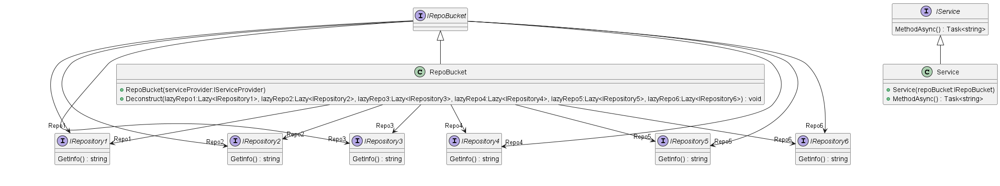

## Bucket Pattern

The Bucket Pattern is a design pattern that aims to solve the problem of messy dependency injection in code with many dependencies. The pattern organizes dependencies into "buckets," with each bucket being a category of dependencies. The Lazy<T> feature is leveraged to provide delayed creation of dependencies until they are needed, resulting in cleaner and more readable code. A practical example is provided, showing how the pattern can be implemented in .NET.

### Problem

The problem that the bucket pattern is trying to solve is how messy the injection of dependencies can be with many dependencies. In order to write cleaner and more appealing code, we can provide a class with its dependencies through a “bucket” filled with common objects.


<caption>In this SampleService there are so many dependencies injected, and the graph of instances that DI needs to resolve is very large. Let’s see how can we improve the code readability in a more appealing way.</caption>


### Solution

Instead, let’s organize dependencies by category. I called them “buckets”, where each bucket is a category. How can we do this without making DI inject all unnecessary graph objects into the bucket?
The solution is to leverage Lazy<T>. The core feature of Lazy<T> is that it provides delayed creation which is thread-safe.

### Practical Example

Let’s see how we can reduce complexity by injecting only one “bucket”.
Structure of the project:


<caption>Project setup, show how setup demo project</caption>


#### Class Diagram:




We will be focusing on the interface IRepoBucket and RepoBucket class.
In IRepoBucket we define the interface of the bucket or common interface that we want to be accessible once the bucket is injected.

```csharp
public interface IRepoBucket
{
  IRepository1 Repo1 { get; }
  IRepository2 Repo2 { get; }
  IRepository3 Repo3 { get; }
  IRepository4 Repo4 { get; }
  IRepository5 Repo5 { get; }
  IRepository6 Repo6 { get; }
}
```

As you can see from the code there are only interfaces of Repository or some common objects.
Now let’s see how we can leverage Lazy<T> to have all interfaces when we need them without any dependency instantiated until we need it.

```csharp
public class RepoBucket : IRepoBucket
{
  private readonly IServiceProvider _serviceProvider;
  private readonly Lazy<IRepository1> _lazyRepo1;
  private readonly Lazy<IRepository2> _lazyRepo2;
  private readonly Lazy<IRepository3> _lazyRepo3;
  private readonly Lazy<IRepository4> _lazyRepo4;
  private readonly Lazy<IRepository5> _lazyRepo5;
  private readonly Lazy<IRepository6> _lazyRepo6;
public RepoBucket(IServiceProvider serviceProvider)
{
  _serviceProvider = serviceProvider;
  _lazyRepo1 = GetInstance<IRepository1>();
  _lazyRepo2 = GetInstance<IRepository2>();
  _lazyRepo3 = GetInstance<IRepository3>();
  _lazyRepo4 = GetInstance<IRepository4>();
  _lazyRepo5 = GetInstance<IRepository5>();
  _lazyRepo6 = GetInstance<IRepository6>();
}
  private Lazy<T> GetInstance<T>() => new(_serviceProvider.GetRequiredService<T>());
  public IRepository1 Repo1 => _lazyRepo1.Value;
  public IRepository2 Repo2 => _lazyRepo2.Value;
  public IRepository3 Repo3 => _lazyRepo3.Value;
  public IRepository4 Repo4 => _lazyRepo4.Value;
  public IRepository5 Repo5 => _lazyRepo5.Value;
  public IRepository6 Repo6 => _lazyRepo6.Value;
}
```
Notice that I defined these lazy objects as read-only, and then defined the constructor of the class where I injected IServiceProvider. Once we need a repository service, the bucket will return an instance of that repository resolved by the ServiceProvider.
Let’s see how this looks when you use it:

```csharp
public class Service : IService
{
  private readonly IRepoBucket _repoBucket;
  public Service(IRepoBucket repoBucket)
  {
  _repoBucket = repoBucket;
  }
  public async Task<string> MethodAsync() => _repoBucket.Repo1.GetInfo();
}
```

From this code, you can see that we only injected IRepoBucket, and we have all repositories in one bucket, and the code looks much cleaner and readable.

Source: [Clean Code: Bucket Pattern, Lazy Dependency Creation in .NET](https://trailheadtechnology.com/clean-code-bucket-pattern-lazy-dependency-creation-in-net/)
